# F1 Service System 🏎️

AI-powered Formula 1 information service combining **LLM orchestration**, **RAG (Retrieval-Augmented Generation)**, and **circuit visualization**. Built with GPT-4o, AWS Bedrock Knowledge Base, and a futuristic Red Bull Racing-themed UI.

[](https://www.python.org/downloads/)
[](https://platform.openai.com/)
[](https://aws.amazon.com/bedrock/)
[](https://smith.langchain.com/)

---

## 📋 Table of Contents

- [Overview](#-overview)
- [Architecture](#-architecture)
- [Features](#-features)
- [Quick Start](#-quick-start)
- [Setup](#-setup)
- [Usage](#-usage)
- [Project Structure](#-project-structure)
- [Performance](#-performance)
- [Development](#-development)
- [Documentation](#-documentation)

---

## 🎯 Overview

The F1 Service System is an intelligent assistant that answers Formula 1 queries using a combination of:

1. **Circuit Image Retrieval**: Display any of 24 F1 2025 circuit maps
2. **Regulations Knowledge Base**: Query FIA F1 regulations using AWS Bedrock RAG
3. **GPT-4o Orchestration**: Intelligent routing and response synthesis

**Key Highlights:**
- 🤖 **Agentic Architecture**: GPT-4o with native function calling
- ⚡ **Fast Response**: 2-5s for circuit queries, 4-7s for regulations
- 🎨 **Modern UI**: Red Bull Racing themed Streamlit interface with Formula 1 fonts
- 💬 **Conversation Memory**: Natural follow-up questions with context
- 📊 **Full Observability**: LangSmith tracing for all operations

---

## 🏗️ Architecture

### System Architecture Diagram

```mermaid
graph TB
    User[👤 User Query] --> UI[🖥️ Streamlit UI<br/>Red Bull Theme]
    UI --> Orchestrator[🤖 GPT-4o Orchestrator<br/>Function Calling]
    
    Orchestrator --> Decision{Query Type?}
    
    Decision -->|Circuit Request| CircuitTool[🏁 Circuit Retrieval Tool<br/>Local File System]
    Decision -->|Regulations Query| RAGTool[📚 Regulations RAG Tool<br/>AWS Bedrock KB]
    Decision -->|Hybrid Query| Both[Both Tools]
    
    CircuitTool --> Storage[(🗂️ Circuit Maps<br/>24 .webp files)]
    RAGTool --> Bedrock[☁️ AWS Bedrock<br/>Knowledge Base]
    Bedrock --> Pinecone[(📊 Pinecone Vector DB<br/>F1 Regulations)]
    Bedrock --> Claude[🧠 Claude 3 Sonnet<br/>Generation Model]
    
    CircuitTool --> Response[📤 Response Aggregation]
    RAGTool --> Response
    Both --> Response
    
    Response --> UI
    UI --> User
    
    Orchestrator -.->|Tracing| LangSmith[📈 LangSmith<br/>Observability]
    CircuitTool -.->|Tracing| LangSmith
    RAGTool -.->|Tracing| LangSmith
    
    style UI fill:#dc0000,stroke:#000,stroke-width:2px,color:#fff
    style Orchestrator fill:#0a0a0a,stroke:#dc0000,stroke-width:2px,color:#fff
    style CircuitTool fill:#1a1a1a,stroke:#dc0000,stroke-width:2px,color:#fff
    style RAGTool fill:#1a1a1a,stroke:#dc0000,stroke-width:2px,color:#fff
    style LangSmith fill:#4a4a4a,stroke:#dc0000,stroke-width:1px,color:#fff
```



### Data Flow Diagram


### Component Architecture

```mermaid
graph LR
    subgraph Frontend[🖥️ Frontend Layer]
        StreamlitUI[Streamlit App<br/>src/ui/app.py]
        Theme[Red Bull Theme<br/>Formula 1 Fonts]
    end
    
    subgraph AgentLayer[🤖 Agent Layer]
        Orchestrator[GPT-4o Orchestrator<br/>src/agents/orchestrator.py]
        FunctionCalling[OpenAI Function<br/>Calling API]
    end
    
    subgraph Tools[🛠️ Tool Layer]
        CircuitTool[Circuit Retrieval<br/>src/tools/circuit_retrieval.py]
        RAGTool[Regulations RAG<br/>src/tools/regulations_rag.py]
    end
    
    subgraph Data[💾 Data Layer]
        CircuitMaps[(Circuit Maps<br/>f1_2025_circuit_maps/)]
        BedrockKB[(AWS Bedrock KB<br/>+ Pinecone)]
    end
    
    subgraph Observability[📊 Observability]
        LangSmith[LangSmith Tracing]
        Loguru[Loguru Logging]
    end
    
    StreamlitUI --> Orchestrator
    Orchestrator --> FunctionCalling
    FunctionCalling --> CircuitTool
    FunctionCalling --> RAGTool
    CircuitTool --> CircuitMaps
    RAGTool --> BedrockKB
    
    Orchestrator -.->|@traceable| LangSmith
    CircuitTool -.->|@traceable| LangSmith
    RAGTool -.->|@traceable| LangSmith
    
    Orchestrator -.->|logger| Loguru
    CircuitTool -.->|logger| Loguru
    RAGTool -.->|logger| Loguru
```

---

## ✨ Features

### 🏁 Circuit Visualization
- **24 F1 2025 Circuit Maps**: High-quality `.webp` images
- **Natural Language Understanding**: "Monaco", "Silverstone", "Vegas", "COTA"
- **Instant Retrieval**: <100ms local file access
- **Futuristic Display**: Red Bull themed with red borders and shadows

### 📚 Regulations Knowledge Base
- **AWS Bedrock Integration**: RetrieveAndGenerate API
- **Claude 3 Sonnet**: Advanced text generation
- **Pinecone Vector DB**: Semantic search over F1 regulations
- **Citation Support**: Source references for answers
- **Fast Responses**: 4-7s average query time

### 🤖 Intelligent Orchestration
- **GPT-4o Agent**: Function calling for tool routing
- **Multi-Tool Coordination**: Handle complex queries requiring both circuit and regulation data
- **Conversation Memory**: Follow-up questions with context awareness
- **Self-Correction**: Retry logic and error handling

### 🎨 Modern UI
- **Red Bull Racing Theme**: Red (#dc0000) and Black (#0a0a0a)
- **Formula 1 Official Fonts**: Loaded via Streamlit config
- **Custom Avatars**: Max Verstappen image + custom user/chatbot icons
- **Responsive Design**: Clean, futuristic, minimalistic interface
- **Music Player**: Max Verstappen theme song integration

---

## 🚀 Quick Start

### Launch the UI

```bash
./run_ui.sh
```

Then open: **http://localhost:8501**

### Try These Queries

```
"Show me the Monaco circuit"
"What are the DRS rules?"
"Display Silverstone and explain the points system"
"What is the minimum car weight?"
```

---

## 🔧 Setup

### Prerequisites

- **Python 3.10+**
- **Poetry** (dependency management)
- **OpenAI API Key** (GPT-4o access)
- **AWS Credentials** (Bedrock Knowledge Base access)
- **LangSmith API Key** (optional, for tracing)

### 1. Install Dependencies

```bash
poetry install
```

### 2. Configure Environment

Create `.env` file in project root:

```bash
# OpenAI Configuration
OPENAI_API_KEY=sk-proj-...
OPENAI_MODEL=gpt-4o

# AWS Bedrock Configuration
AWS_ACCESS_KEY_ID=...
AWS_SECRET_ACCESS_KEY=...
AWS_REGION=us-east-1
BEDROCK_KNOWLEDGE_BASE_ID=BJGTYMNOBH
BEDROCK_GENERATION_MODEL=anthropic.claude-3-sonnet-20240229-v1:0

# LangSmith Tracing (Optional)
LANGCHAIN_TRACING_V2=true
LANGCHAIN_API_KEY=...
LANGCHAIN_PROJECT=f1-service-system-v1
```

### 3. Verify Setup

```bash
# Test circuit retrieval
poetry run python -c "from src.tools.circuit_retrieval import get_circuit_retrieval; print(get_circuit_retrieval().get_circuit_image('Monaco'))"

# Test regulations RAG
poetry run python -c "from src.tools.regulations_rag import get_regulations_rag; result = get_regulations_rag().query_regulations('What is DRS?'); print(result['metadata']['status'])"
```

---

## 💻 Usage

### Python API

```python
from src.agents.orchestrator import get_orchestrator

# Initialize orchestrator
orchestrator = get_orchestrator()

# Simple circuit query
result = orchestrator.process_query("Show me the Monaco circuit")
print(result['content'])  # Circuit description
print(result['tool_results']['get_circuit_image']['content'])  # Image path

# Regulations query
result = orchestrator.process_query("What are the DRS rules?")
print(result['content'])  # Detailed answer
print(result['metadata']['latency_seconds'])  # Response time

# Complex query with conversation history
history = [
    ("user", "Show me the Monaco circuit"),
    ("assistant", "Here is the Monaco circuit...")
]
result = orchestrator.process_query(
    "What are the safety car rules for this track?",
    conversation_history=history
)
```

### Command Line

```bash
# Launch UI
./run_ui.sh

# Run tests
poetry run python scripts/test_orchestrator.py

# Check model performance
poetry run python scripts/test_model_latency.py
```

---

## 📁 Project Structure

```
f1-service-system-v1/
├── src/
│   ├── agents/
│   │   └── orchestrator.py          # GPT-4o orchestrator with function calling
│   ├── tools/
│   │   ├── circuit_retrieval.py     # Circuit image retrieval tool
│   │   └── regulations_rag.py       # AWS Bedrock RAG tool
│   ├── ui/
│   │   ├── app.py                   # Streamlit application
│   │   ├── static/                  # Formula 1 fonts
│   │   ├── max.avif                 # Max Verstappen image
│   │   ├── user-icon.png            # Custom user avatar
│   │   └── chatbot-icon.png         # Custom chatbot avatar
│   └── config/
│       └── settings.py              # Environment configuration
├── f1_2025_circuit_maps/            # 24 circuit maps (.webp)
│   ├── Monaco_Circuit.webp
│   ├── Silverstone_Circuit.webp
│   └── ...
├── music/                           # Theme music files
│   └── tu-tu-tu-du-max-verstappen.mp3
├── .streamlit/
│   └── config.toml                  # Streamlit theme configuration
├── scripts/                         # Test and utility scripts
├── docs/                            # Documentation
├── pyproject.toml                   # Poetry dependencies
├── .env                             # Environment variables (not in git)
└── run_ui.sh                        # UI launch script
```

---

## ⚡ Performance

### Response Times

| Query Type | Average Time | Tool(s) Used |
|------------|--------------|--------------|
| Circuit only | 2-3s | `get_circuit_image` |
| Regulations only | 4-7s | `query_regulations` |
| Hybrid query | 6-10s | Both tools |

### Bottlenecks

- **GPT-4o function calling**: ~2s per iteration
- **AWS Bedrock API**: ~4-5s per query
- **Circuit retrieval**: <0.1s (local files)

### Optimizations

✅ **Non-streaming API**: Simpler, more reliable
✅ **Retry logic**: Handles throttling gracefully
✅ **Connection pooling**: Reuse AWS/OpenAI connections
✅ **Caching**: Singleton pattern for tool instances

---

## 🛠️ Development

### Coding Standards

#### 1. Always Use Loguru (Never `print()`)

```python
from loguru import logger

# Good ✓
logger.info("Processing query: {}", user_query)
logger.success("Tool executed successfully")
logger.error("Failed to retrieve: {}", error)
logger.debug("Intermediate result: {}", data)

# Bad ✗
print("Processing query:", user_query)
```

#### 2. Always Use Poetry (Never `pip`)

```bash
# Good ✓
poetry add <package>
poetry install
poetry run python script.py

# Bad ✗
pip install <package>
python script.py
```

#### 3. Add Type Hints

```python
def query_regulations(
    question: str,
    num_results: int = 5
) -> Dict[str, Any]:
    """Query F1 regulations."""
    pass
```

#### 4. Use LangSmith Tracing

```python
from langsmith import traceable

@traceable(name="my_function", tags=["tool", "bedrock"])
def my_function(query: str) -> dict:
    """Traced function."""
    pass
```

### Running Tests

```bash
# Test orchestrator
poetry run python scripts/test_orchestrator.py

# Test individual tools
poetry run python -c "from src.tools.circuit_retrieval import get_circuit_retrieval; print(get_circuit_retrieval().get_circuit_image('Monaco'))"

# Test model performance
poetry run python scripts/test_model_latency.py
```

### Project Configuration

#### Streamlit Theme (`.streamlit/config.toml`)

```toml
[server]
enableStaticServing = true

[[theme.fontFaces]]
family = "Formula1"
url = "app/static/Formula1-Regular_web_0.ttf"
weight = 400

[theme]
font = "Formula1"
primaryColor = "#dc0000"
backgroundColor = "#0a0a0a"
textColor = "#ffffff"
```

#### Environment Variables

See `.env.example` or [Setup](#-setup) section.

---

## 📖 Documentation

### Additional Resources

- **[Architecture Decision](docs/ACCURACY_COMPARISON.md)**: Why RetrieveAndGenerate vs Retrieve + Generate
- **[Model Comparison](docs/MODEL_COMPARISON.md)**: Performance across different models
- **[GPT-4o vs GPT-4o-mini](docs/)**: Speed vs intelligence tradeoffs

### LangSmith Traces

View all operations: **https://smith.langchain.com/**

**Traced Operations:**
- `gpt4o_orchestrator`: Main orchestration logic
- `get_circuit_image`: Circuit retrieval
- `query_regulations`: Bedrock RAG queries

---

## 🎯 Roadmap

### ✅ Completed

- [x] GPT-4o orchestrator with function calling
- [x] Circuit image retrieval (24 circuits)
- [x] AWS Bedrock RAG integration
- [x] Streamlit UI with Red Bull theme
- [x] Formula 1 fonts integration
- [x] Custom avatars and theme music
- [x] Conversation memory
- [x] LangSmith tracing
- [x] Comprehensive logging

### 🚧 In Progress

- [ ] Improved citation tracing for retrieved chunks
- [ ] Response streaming for better UX

### 📝 Planned

- [ ] Race results and standings data
- [ ] Driver and team information
- [ ] Calendar and schedule queries
- [ ] Historical F1 data integration
- [ ] Tool result caching
- [ ] Parallel tool execution optimization

---

## 🏎️ Architecture Evolution

### Previous Version (LangGraph-based)

❌ **Problems:**
- Hardcoded intent classification
- 60+ location aliases manually maintained
- Keyword-based routing (brittle)
- StateGraph complexity

### Current Version (GPT-4o Function Calling)

✅ **Benefits:**
- Natural language understanding
- Zero hardcoded aliases
- Intelligent tool routing
- Self-correcting behavior
- Easier maintenance

---

## 🤝 Contributing

Contributions welcome! Please:

1. Use **Poetry** for dependencies
2. Use **Loguru** for logging (never `print`)
3. Add **type hints** to all functions
4. Include **docstrings** for public methods
5. Add **@traceable** for key operations
6. Update **tests** for new features
7. Update **documentation**

---

## 📄 License

This project is licensed under the [MIT License](LICENSE).

---

## 🔗 References

- [OpenAI GPT-4o](https://platform.openai.com/docs/models/gpt-4o)
- [AWS Bedrock Knowledge Bases](https://docs.aws.amazon.com/bedrock/latest/userguide/knowledge-base.html)
- [LangSmith Documentation](https://docs.smith.langchain.com/)
- [Streamlit Documentation](https://docs.streamlit.io/)
- [FIA F1 Regulations](https://www.fia.com/regulation/category/110)
- [Pinecone Vector Database](https://www.pinecone.io/)

---

## 👤 Author

**Long Hoang**
- GitHub: [@longhoag](https://github.com/longhoag)
- Project: F1 Service System v1

---

<div align="center">

**🏎️ Built with ❤️ for Formula 1 fans 🏎️**

*Powered by GPT-4o, AWS Bedrock, and Red Bull Racing spirit*

</div>
